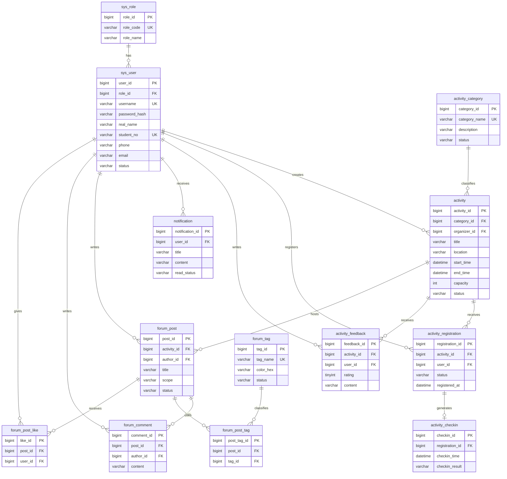

# ER 模型设计

## 实体列表

| 实体 | 表名 | 说明 |
| --- | --- | --- |
| 角色 | `sys_role` | 存储学生、组织者、管理员等角色 |
| 用户 | `sys_user` | 存储登录用户和基础资料 |
| 活动分类 | `activity_category` | 存储讲座、比赛、社团、志愿服务等分类 |
| 活动 | `activity` | 存储活动基础信息、时间、地点、名额、状态 |
| 活动报名 | `activity_registration` | 记录用户对活动的报名状态 |
| 活动签到 | `activity_checkin` | 记录报名用户的签到时间和签到结果 |
| 活动反馈 | `activity_feedback` | 记录活动结束后的评分和评价 |
| 通知 | `notification` | 记录面向用户的系统通知 |
| 论坛帖子 | `forum_post` | 记录围绕活动展开的讨论帖 |
| 论坛评论 | `forum_comment` | 记录帖子下的评论互动 |
| 论坛标签 | `forum_tag` | 记录讨论标签 |
| 帖子标签关系 | `forum_post_tag` | 记录帖子与标签的多对多关系 |
| 帖子点赞 | `forum_post_like` | 记录用户对帖子点赞 |

## ER 关系

## 关系说明

- 一个角色可以对应多个用户。
- 一个用户可以创建多个活动。
- 一个活动分类可以包含多个活动。
- 一个用户可以报名多个活动。
- 一个活动可以拥有多条报名记录。
- 一条报名记录最多对应一条签到记录。
- 一个用户可以对多个活动提交反馈。
- 一个活动可以收到多条反馈。
- 一个用户可以收到多条通知。
- 一个活动可以拥有多条论坛帖子。
- 一个帖子可以收到多条评论和点赞。
- 一个帖子可以关联多个标签，一个标签也可以被多个帖子复用。
- 已结束活动的帖子和反馈共同构成“往期活动”展示区。
